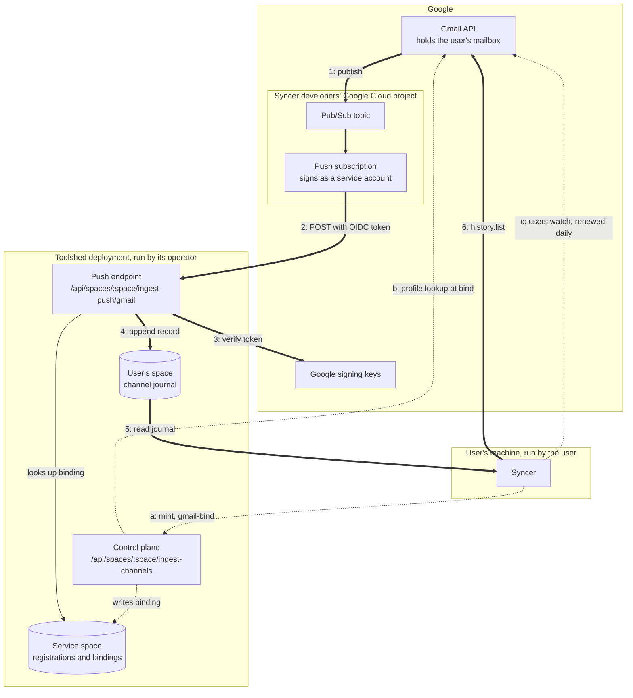
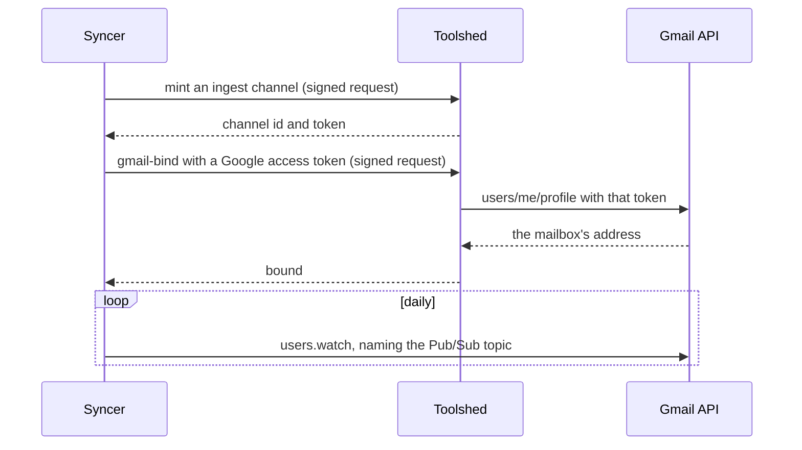
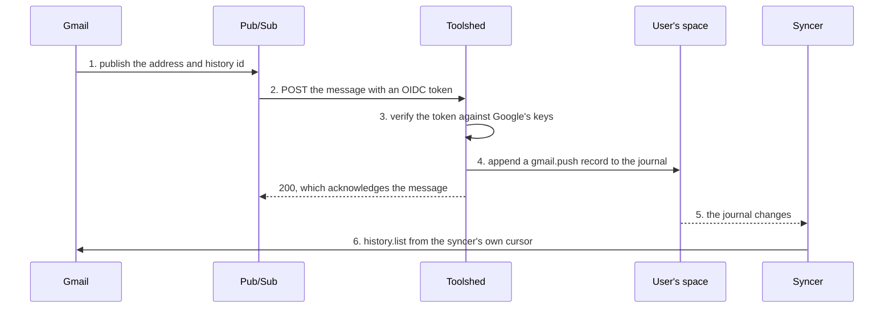

# Gmail push architecture

How a new message in a Gmail inbox becomes a resync on the user's machine: the
servers and clients involved, who runs each one, and what each hop between
them proves. Four parties take part, and no single one sees the whole path, so
this document follows it end to end.

[`gmail-push-ingest.md`](gmail-push-ingest.md) is the reference for the part
toolshed implements: its routes, status codes, record shape, and settings.
This document is the map around it.

The syncer is whatever program keeps a local copy of the mailbox. It runs on
the user's machine, holds the user's Google token, and is not reachable from
the internet, which is why the notification has to land somewhere public
first.

## Who runs what

Thick numbered arrows run on every new message. Dotted lettered arrows are
setup, or repeat on a schedule.

| Piece | Runs on | Controlled by | What they decide |
| --- | --- | --- | --- |
| Gmail API and the mailbox | Google | Google; the mailbox is the user's | When a notification fires. Delivery is best-effort. |
| Pub/Sub topic and push subscription | The Google Cloud project that owns the syncer's OAuth client | The syncer's developers | The topic, the push endpoint URL, the audience, and the service account that signs push tokens. |
| Google signing keys | Google | Google | Key rotation. Toolshed caches the keys and fetches them again for a key id it has not seen. |
| Push endpoint and control plane | The toolshed deployment | The deployment's operator | Whether the feature is on, and which audience and service accounts are accepted. |
| The service space | The toolshed deployment | The deployment's operator | Holds channel registrations and mailbox bindings for every user. |
| The user's space | The toolshed deployment | The user, as OWNER in its ACL | Who may mint a channel into it. The journal lands here. |
| Syncer | The user's machine | The user | Calling and renewing `users.watch`, binding, and when to sync. |

Two of these are one party's data on another party's server: the mailbox,
which Google holds, and the user's space, which the toolshed deployment hosts.

The topic has to be in the same Google Cloud project as the OAuth client whose
token calls `users.watch`. That is a Gmail requirement, and it is why the
Pub/Sub side belongs to the syncer's developers and not to the toolshed
operator. A syncer whose users sign in through more than one OAuth client
needs one topic for each client's project.

## Setting up

Minting and binding happen once for each channel, and a mailbox can have up
to eight channels bound to it, one for each install of a syncer. The watch is
set once for the mailbox, whatever the number of channels, and is renewed
daily.

The syncer never uses the channel's token. A channel is normally written by a
device presenting that token to `POST /api/spaces/:space/ingest/:id`. Here
toolshed is the writer, and what authorizes each write is the push token and
the binding.

## What each request is addressed to

Every request toolshed receives on this path names a space in its URL, so
that whatever dispatches requests by space can send it to the deployment
holding that space.

| Request | The space in its path |
| --- | --- |
| Mint, `gmail-bind`, `gmail-unbind` | The user's space, which the channel writes into. |
| The push from Pub/Sub | The service space, which holds the bindings. Pub/Sub knows a mailbox and no user's space. |

The push is the one request that cannot name the user's space, and a binding
is written wherever its `gmail-bind` was handled. So the push subscription's
endpoint names the service space of the deployment that holds the user's
space, and one topic serving several deployments has one subscription for
each.

## When new mail arrives

Toolshed never sees a message, a sender, or a subject. Step 1 carries the
address and a history id and nothing more, and the mail itself travels only in
step 6, directly between Google and the user's machine.

In step 5 the syncer reads the journal out of its own space, the way any
client reads a cell. Toolshed opens no connection to the user's machine, and
how the syncer watches for the change is the syncer's own business.

## What each crossing proves

- **Pub/Sub to toolshed (2, 3).** The OIDC token proves the request comes from
  something able to act as a service account this deployment accepts, for
  this deployment's audience: toolshed checks the signature, the issuer, the
  audience, and the service account. The token does not cover the body, and
  names no subscription. So the trust boundary is the service account: anyone
  who can mint a token as it can post a notification for any bound mailbox,
  as often as it likes. That discloses nothing, since a record carries no mail
  and the syncer fetches changes from Gmail itself. What it costs is
  availability: each post adds a record to the journal of every channel bound
  to the mailbox and prompts a sync, so a holder of the account can grow those
  journals and keep syncers busy.
- **Syncer to control plane (a).** The signed request proves the caller's
  identity key, and the channel's space must list that identity as OWNER.
- **Toolshed to Gmail (b).** The access token proves the caller can read the
  mailbox being bound. Toolshed uses it for one profile lookup and stores it
  nowhere. Without this, anyone could bind someone else's address to their own
  channel and learn when that person's mail arrives.

## What can go wrong

| Failure | What absorbs it |
| --- | --- |
| Gmail drops or delays a notification | The syncer's slower poll. |
| Toolshed is down, or storage fails | Toolshed returns a non-2xx status or nothing, and Pub/Sub redelivers with backoff. |
| Pub/Sub delivers a message twice | The journal gets two records. The syncer compares history ids and skips the one it already covered. |
| The watch expires | The syncer's daily renewal. A watch lasts seven days. |
| The channel is revoked or expired | Delivery skips it. The syncer rotates the channel or mints a new one, then binds again. |
| The syncer was offline | The journal keeps the records, and the syncer catches up from its cursor when it returns. |
| The sync falls out of Gmail's history window | The syncer's own recovery, which is a bounded full sync. |

## Where the code is

- [`packages/toolshed/routes/ingest-push/`](../../packages/toolshed/routes/ingest-push/)
  holds the push endpoint, token verification, and the binding store.
- [`packages/toolshed/routes/ingest-channels/`](../../packages/toolshed/routes/ingest-channels/)
  holds the control plane, with the binding verbs in `gmail-binding.utils.ts`.
- [`packages/toolshed/routes/ingest/`](../../packages/toolshed/routes/ingest/)
  holds the channel registry and the journal append both paths share.
