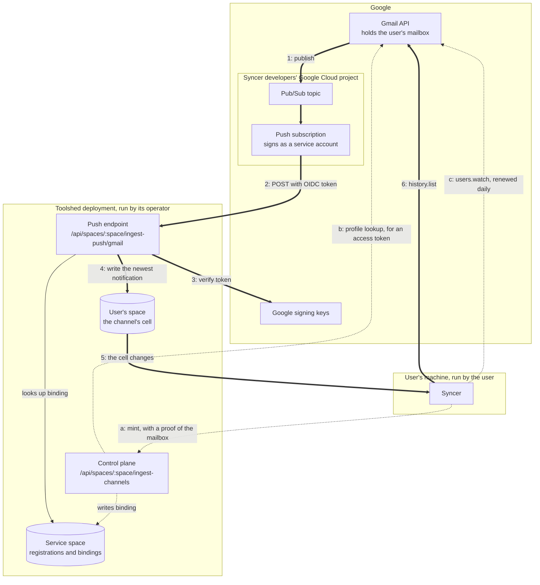
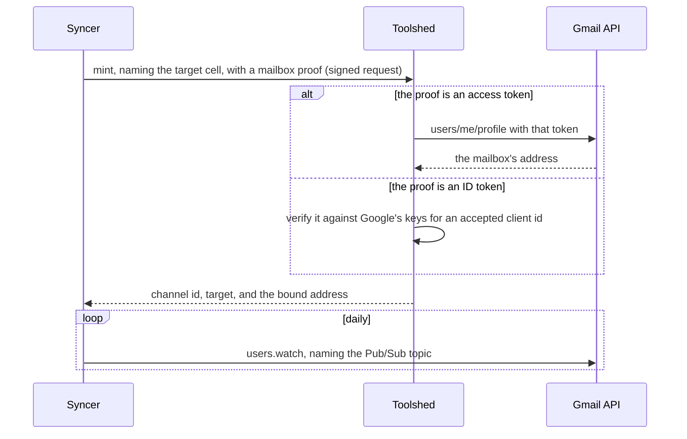
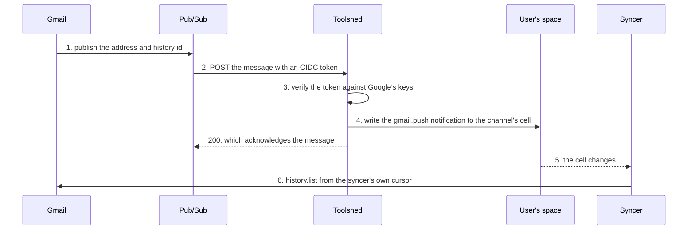
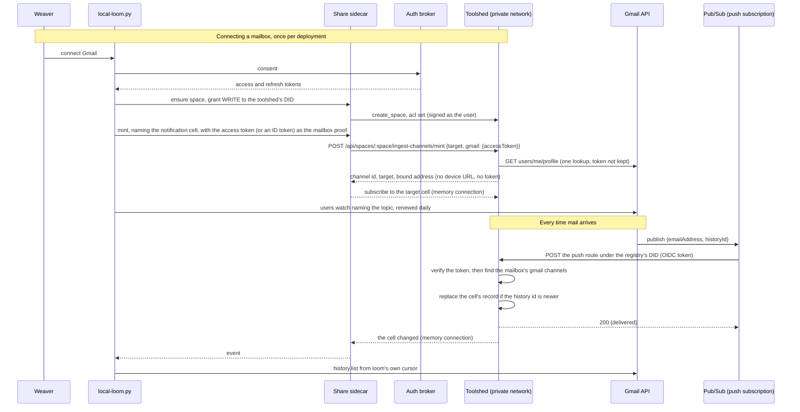

# Gmail push architecture

How a new message in a Gmail inbox becomes a resync on the user's machine: the
servers and clients involved, who runs each one, and what each hop between
them proves. Four parties take part, and no single one sees the whole path, so
this document follows it end to end.

[`gmail-push-ingest.md`](gmail-push-ingest.md) is the reference for the part
toolshed implements: its routes, status codes, record shape, and settings.
This document is the map around it.

The syncer is whatever program keeps a local copy of the mailbox. It runs on
the user's machine, holds the user's Google token, and is not reachable from
the internet, which is why the notification has to land somewhere public
first.

## Who runs what

Thick numbered arrows run on every new message. Dotted lettered arrows are
setup, or repeat on a schedule.

| Piece | Runs on | Controlled by | What they decide |
| --- | --- | --- | --- |
| Gmail API and the mailbox | Google | Google; the mailbox is the user's | When a notification fires. Delivery is best-effort. |
| Pub/Sub topic and push subscription | The Google Cloud project that owns the syncer's OAuth client | The syncer's developers | The topic, the push endpoint URL, the audience, and the service account that signs push tokens. |
| Google signing keys | Google | Google | Key rotation. Toolshed caches the keys and fetches them again for a key id it has not seen. |
| Push endpoint and control plane | The toolshed deployment | The deployment's operator | Whether the feature is on, and which audience and service accounts are accepted. |
| The service space | The toolshed deployment | The deployment's operator | Holds channel registrations and mailbox bindings for every user. |
| The user's space | The toolshed deployment | The user, as OWNER in its ACL | Who may mint a channel into it. The channel's cell lives here. |
| Syncer | The user's machine | The user | Calling and renewing `users.watch`, binding, and when to sync. |

Two of these are one party's data on another party's server: the mailbox,
which Google holds, and the user's space, which the toolshed deployment hosts.

The topic has to be in the same Google Cloud project as the OAuth client whose
token calls `users.watch`. That is a Gmail requirement, and it is why the
Pub/Sub side belongs to the syncer's developers and not to the toolshed
operator. A syncer whose users sign in through more than one OAuth client
needs one topic for each client's project.

## Setting up

Minting and binding happen once for each channel, and a mailbox can have up
to eight channels bound to it, one for each install of a syncer. A mailbox
that should wake more than one deployment has a channel bound on each, and
each deployment has a subscription of its own on the topic;
[the setup document](gmail-push-setup.md#several-deployments) has the
commands. The watch is
set once for the mailbox, whatever the number of channels, and is renewed
daily.

The two kinds of channel are written by different parties. A device
channel is written by a device presenting the channel's bearer token to
`POST /api/spaces/:space/ingest/:id`, into journal cells under its cause
prefix, and that token is what mint returns for it. A gmail channel has no
device token and no device URL, since nothing POSTs to it: toolshed itself
writes the one cell its mint named on each Gmail delivery, and what
authorizes that write is the push token and the binding.

## What each request is addressed to

Every request toolshed receives on this path names a space in its URL, so
that whatever dispatches requests by space can send it to the deployment
holding that space.

| Request | The space in its path |
| --- | --- |
| Mint, carrying the mailbox proof | The user's space, which the channel writes into. |
| The push from Pub/Sub | The service space, which holds the bindings. Pub/Sub knows a mailbox and no user's space. |

The push is the one request that cannot name the user's space, and a binding
is written wherever its mint was handled. So the push subscription's
endpoint names the service space of the deployment that holds the user's
space, and one topic serving several deployments has one subscription for
each.

## When new mail arrives

Toolshed never sees a message, a sender, or a subject. Step 1 carries the
address and a history id and nothing more, and the mail itself travels only in
step 6, directly between Google and the user's machine.

In step 5 the syncer reads the cell out of its own space, the way any client
reads a cell, and a subscription on it fires when toolshed's write lands.
Toolshed opens no connection to the user's machine. The cell holds only the
newest notification, so it never grows, and one subscription serves for as
long as the syncer runs.

## How the pieces talk

The whole conversation, from a weaver connecting a Gmail account to loom
being woken by mail. The calls that cross between the user's machine and
toolshed are of two kinds, the signed control-plane calls over the private
network and the cell subscription over the memory connection the sidecar
already holds, and one call crosses from Google to toolshed: the push, over
the public internet for a deployment Google can reach, or from a relay on the
private network that pulls each message for one Google cannot, as
[the setup document](gmail-push-setup.md#a-deployment-on-a-private-network)
describes. The rest are either local to the user's machine or ordinary calls
to Google: the broker consent, the profile lookup, the watch, and the
history fetch. The diagram shows one deployment; a second one is the
same picture again with its own subscription and its own bindings, as
[Setting up](#setting-up) says.

Three facts decide the shape.

- **Who signs what.** Mint and the space calls are signed with the user's
  own identity key, which the share sidecar is launched with, and the
  toolshed authorizes each against an OWNER grant read from the named
  space's access list at the time of the call. So they are the user's
  calls, made from the user's machine, and need only the reach that machine
  already has to its toolshed: a private network is fine.
  The push is Google's call, signed by a service account the toolshed was
  configured to accept, so where a deployment faces the internet at all, the
  push route is the one path that needs to. A deployment on a private
  network faces it nowhere, and a relay inside the network makes the same
  call with the same token instead.
- **Where the binding lives.** It lives in the registry of the toolshed that
  handled the bind, and a push is delivered against the bindings of the
  toolshed that received it. A mailbox that should wake two deployments has a
  channel bound on each, and each deployment has its own subscription on the
  topic. Nothing forwards a push between deployments.
- **What wakes loom.** The sidecar's subscription on the channel's cell, over
  the memory connection it already holds. The cell holds only the newest
  notification and only ever moves forward, so a redelivery changes nothing
  and wakes nothing, and one subscription serves for the life of the binding.

## What each crossing proves

- **Pub/Sub to toolshed (2, 3).** The OIDC token proves the request comes from
  something able to act as a service account this deployment accepts, for
  this deployment's audience: toolshed checks the signature, the issuer, the
  audience, and the service account. The token does not cover the body, and
  names no subscription. So the trust boundary is the service account: anyone
  who can mint a token as it can post a notification for any bound mailbox,
  as often as it likes. That exposes no mailbox contents, since a record
  carries no mail and the syncer fetches changes from Gmail itself. It does
  expose one fact: the response counts the live channels the notification
  reached, so a holder of the account can learn whether an address is bound,
  and to how many channels. And it costs availability: each post carrying a
  newer history id changes the cell of every channel bound to the mailbox and
  prompts a sync, so a holder can keep syncers busy. A post that carries no
  newer id changes nothing.
- **Syncer to control plane (a).** The signed request proves the caller's
  identity key, and the channel's space must list that identity as OWNER.
- **Toolshed to Gmail (b).** The access token proves the caller can read the
  mailbox being bound. Toolshed uses it for one profile lookup and stores it
  nowhere. Without this, anyone could bind someone else's address to their own
  channel and learn when that person's mail arrives.

## What can go wrong

| Failure | What absorbs it |
| --- | --- |
| Gmail drops or delays a notification | The syncer's slower poll. |
| Toolshed is down, or storage fails | Toolshed returns a non-2xx status or nothing, and Pub/Sub redelivers with backoff. |
| Pub/Sub delivers a message twice | The second delivery carries no newer history id, so the cell does not change and the syncer is not woken. |
| The watch expires | The syncer's daily renewal. A watch lasts seven days. |
| The channel is revoked or expired | Delivery skips it. The syncer mints the channel again with the mailbox proof, which re-enables it and keeps or restores the binding. Rotate alone keeps an existing binding but cannot make one. |
| The syncer was offline | The cell holds the newest history id, and the syncer catches up from its own cursor when it returns. |
| The sync falls out of Gmail's history window | The syncer's own recovery, which is a bounded full sync. |

## Where the code is

- [`packages/toolshed/routes/ingest-push/`](../../packages/toolshed/routes/ingest-push/)
  holds the push endpoint, token verification, and the binding store.
- [`packages/toolshed/routes/ingest-channels/`](../../packages/toolshed/routes/ingest-channels/)
  holds the control plane, whose mint takes the mailbox proof.
- [`packages/toolshed/routes/ingest/`](../../packages/toolshed/routes/ingest/)
  holds the channel registry, and the vouched writes behind both kinds of
  channel.
